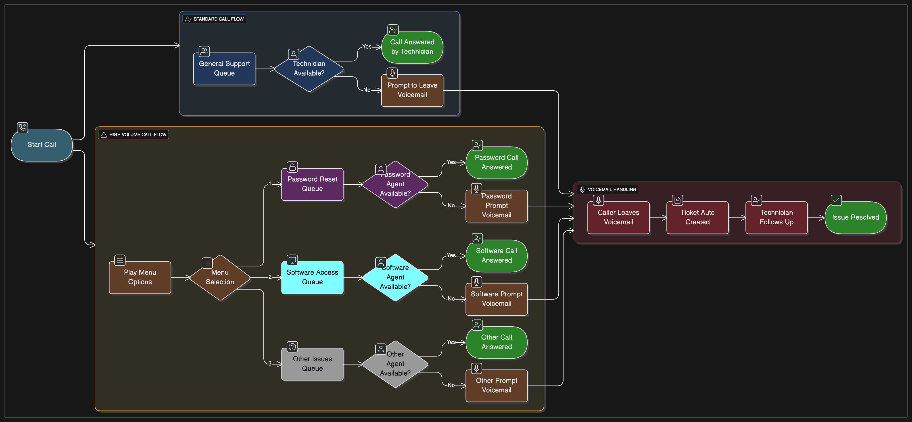
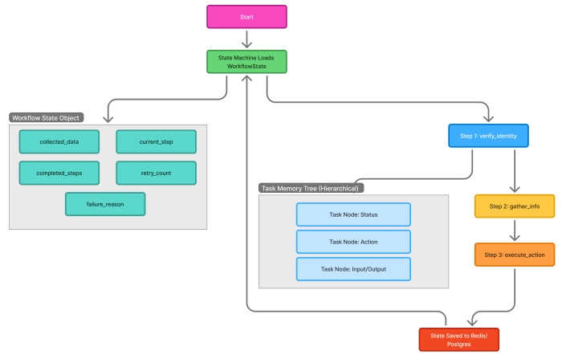

# 🧠 FASE 3 – Workflows y Control de Flujo

## 🎯 Objetivo de la fase

Al terminar esta fase deberías poder:

- Diseñar workflows robustos

- Orquestar múltiples agents

- Controlar errores, retries y branches

- Pensar como ingeniero de sistemas, no como prompt engineer

---

## 1️⃣ El Workflow es el cerebro (idea central)

En Mastra:

- El Workflow decide → el Agent opina → la Tool ejecuta

Nunca al revés.


Analogía DevOps

- Workflow → GitHub Actions / Argo / Temporal

- Step → Job / Task

- Agent → Reviewer humano

- Tool → Script / CLI

---

## 2️⃣ Anatomía de un Workflow serio

Un workflow bien hecho define explícitamente:

- Inputs

- Steps

- Dependencias

- Condiciones

- Errores

- Outputs

Nada implícito. Nada “el LLM sabrá”.

---

## 3️⃣ Steps: piezas atómicas

### Tipos comunes de Step

|Tipo|Qué hace|
|---|---|
|Agent step|Llama a un agent|
|Tool step|Ejecuta acción real|
|Logic step|If / switch / map|
|Validation step|Verifica outputs|
|Reporting step|Notifica|

👉 Un step hace una sola cosa.

---

## 4️⃣ Control de flujo (donde Mastra brilla)

### 🔀 Branching (if / switch)

Ejemplo mental:

```text
IF error.type == BUILD  -> buildFlow
IF error.type == INFRA  -> infraFlow
ELSE                   -> manualReview
```

💡 El LLM no decide el branch, solo devuelve datos.

---

### 🔁 Retry (inteligente, no ciego)

Retry se usa cuando:

- El LLM falló

- El output es inválido

- Timeout transitorio

❌ No retry:

- Decisiones de negocio

- Acciones destructivas

---

### 🧯 Fallback

Ejemplo:

- Agent falla → agent más simple

- Tool falla → modo dry-run

- Infra falla → abort + notify

---

## 5️⃣ Error handling (esto es PRO)

### Tipos de error

|Tipo|Ejemplo|
|---|---|
|LLM error|JSON inválido|
|Tool error|kubectl falla|
|Logic error|estado inconsistente|
|Fatal|no se puede continuar|

💡 Regla:

Todo error debe tener destino

Nada de “crash y chau”.

---

## 6️⃣ Estado del workflow (state is king 👑)

El workflow mantiene un state compartido:

```json
{
  "log": "...",
  "classification": {...},
  "decision": "...",
  "attempts": 2
}
```

Ventajas:

- Reproducible

- Debuggeable

- Auditable





---

## 7️⃣ Ejemplo completo (conceptual, sin lenguaje)

### Caso: CI Fixflow básico

#### Workflow: ci-failure-handler

1. Input: logs, repo, branch

2. Step: classify-error (agent)

3. Step: validate-classification

4. Switch:

    - BUILD → build-fix-flow
    - TEST → test-fix-flow
    - INFRA → infra-review

5. Step: report-result

👉 El workflow nunca improvisa.

---

### 8️⃣ Anti-patterns de workflows (evitalos)

🚫 Workflow con 1 step gigante

🚫 Branching dentro del agent

🚫 LLM decidiendo acciones destructivas

🚫 Estado implícito

🚫 Retry infinito

---

### 9️⃣ Ejercicio práctico (muy importante)

Diseñá en texto este workflow:

- Workflow: pr-auto-review

Definí:

- Inputs

- Steps (ordenados)

- Dónde hay branching

- Qué pasa si falla un agent

- Output final

No código. Arquitectura.