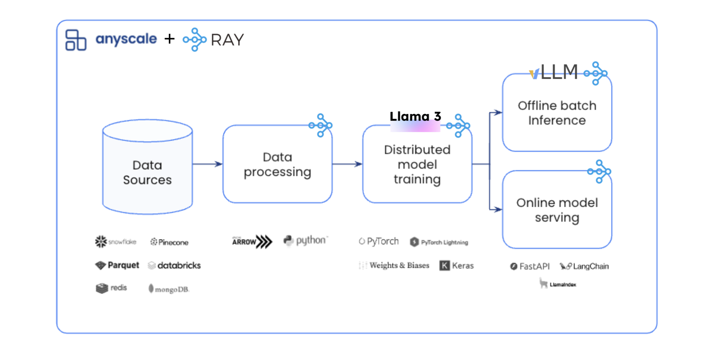
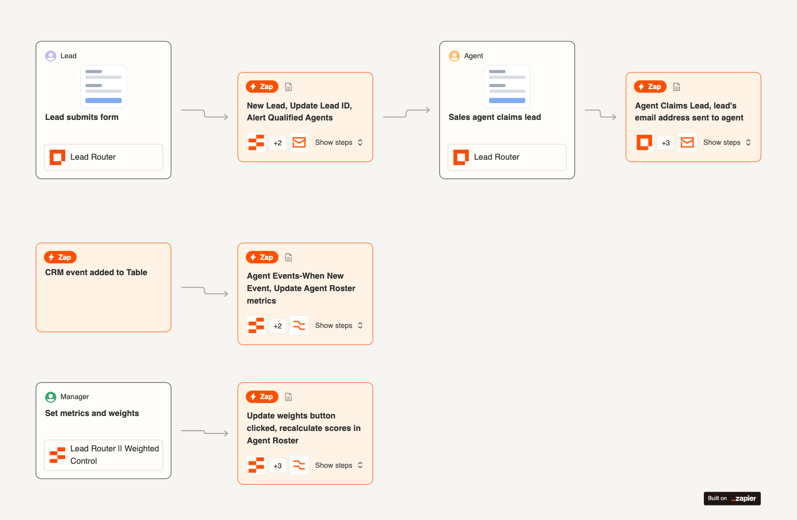

# 🧠 FASE 3 – Workflows y Control de Flujo

## 🎯 Objetivo de la fase

Al terminar esta fase deberías poder:

- Diseñar workflows robustos

- Orquestar múltiples agents

- Controlar errores, retries y branches

- Pensar como ingeniero de sistemas, no como prompt engineer

---

## 1️⃣ El Workflow es el cerebro (idea central)

En Mastra:

- El Workflow decide → el Agent opina → la Tool ejecuta

Nunca al revés.

Analogía DevOps

- Workflow → GitHub Actions / Argo / Temporal

Step → Job / Task

Agent → Reviewer humano

Tool → Script / CLI