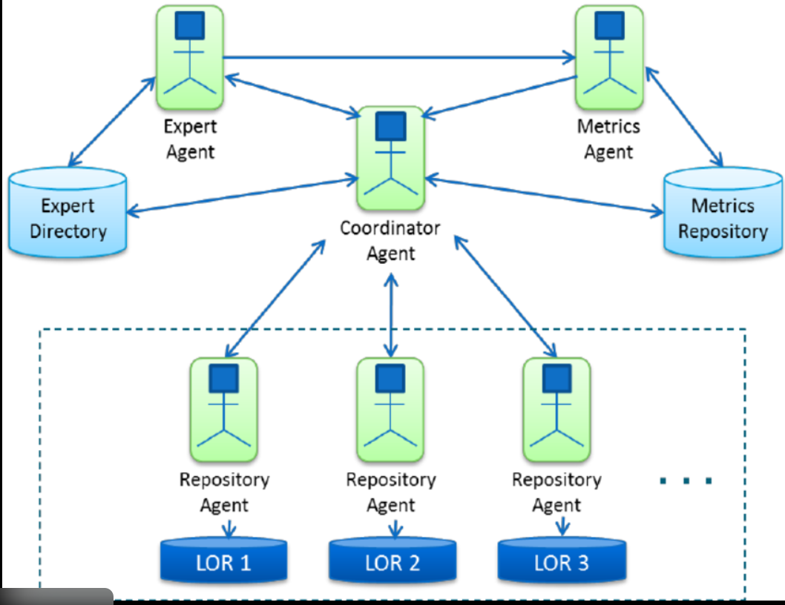

# 🧠 FASE 7 – Arquitectura avanzada (Multi-Agent + AI-Ops)

## 🎯 Objetivo de la fase

Que puedas diseñar un sistema Mastra que:

- use varios agentes especializados

- tenga control jerárquico

- sea seguro (acciones peligrosas con guardrails)

- escale a muchos repos / muchos runs

- pueda operar como producto (observabilidad + costos + auditoría)

---

## 1️⃣ Arquitecturas multi-agent más usadas

### A) Manager → Specialists (la más productiva)

Un agente “manager” coordina, pero no hace todo.

- ManagerAgent: decide estrategia

- SpecialistAgents: hacen tareas específicas

    - Classifier

    - FixPlanner

    - PatchWriter

    - PRWriter

    - RiskReviewer

✅ Ventajas: control + modularidad + fácil test

⚠️ Riesgo: manager demasiado poderoso (se mitiga con reglas en workflow)

### B) Pipeline de agentes (cadena)

Cada agente produce output para el siguiente.

Classifier → Planner → Writer → Reviewer

✅ Simple y trazable

⚠️ Puede propagar errores si no validás outputs entre steps

### C) Debate / Voting

2–3 agentes proponen soluciones y votan.

✅ Reduce alucinaciones

⚠️ Cuesta más tokens/costo

📌 Útil para decisiones críticas (infra, security)

### D) Swarm / “colmena”

Muchos agentes chicos resuelven subtareas en paralelo.

✅ Escala para investigación, triage masivo

⚠️ Requiere scheduler, presupuesto y aggregation serio

---

## 2️⃣ Pattern AI-Ops “de verdad” (lo que usarías vos)

### Pattern 1: Triage → Plan → Apply → Verify → Report

El workflow orquesta:

- Triage (clasificar)

- Plan (qué cambiar)

- Apply (hacer cambios)

- Verify (tests/linters)

- Report (PR + comentario + slack)

### 📌 Regla:

“No hay Apply sin Plan. No hay Merge sin Verify.”

### Pattern 2: Risk Gate

Antes de ejecutar tools sensibles:

- RiskReviewerAgent puntúa riesgo

- Workflow decide:

    - auto (low risk)

    - manual approval (medium)

    - abort (high)

Ejemplo de riesgos:

- tocar .github/workflows

- cambiar IAM/RBAC

- tocar Terraform en prod

- ejecutar apply / delete

### Pattern 3: Progressive Automation

No automatices todo al principio.

- Semana 1: solo análisis + comentario

- Semana 2: PR draft sin merge

- Semana 3: PR completo + test

- Semana 4: auto-merge en low risk

✅ Esto te evita incendios.

---

## 3️⃣ Diseño recomendado para tu Fixflow (arquitectura)

### 🎛️ Orquestación (workflow manda)

Workflow: ci-fixflow

Agents:

- ErrorClassifierAgent

- FixPlannerAgent

- PatchGeneratorAgent

- RiskReviewerAgent

- PRSummaryAgent

Tools:

- read_ci_artifacts()

- search_repo_code()

- apply_patch()

- run_tests()

- git_commit_push()

- open_pr()

- comment_pr_or_run()

(opcional) notify_slack()

---

## 4️⃣ Estado avanzado (state) para multi-agent

Tu state debería guardar:

- trace_id

- classification + confidence

- plans[] (si hay voting o alternativas)

- selected_plan

- risk_score + razones

- patch + diff_hash

- verification (tests)

- pr_url / pr_number

- cost (tokens, tiempo)

📌 Con esto podés auditar todo.

---

## 5️⃣ Orquestación avanzada (control pro)

### 🔁 Retry inteligente por etapa

- Retry en Classifier si JSON inválido

- Retry en PatchGenerator si diff vacío

- No retry en tools destructivas

🧱 Circuit breakers

- abort si risk_score > threshold

- abort si attempts > N

- abort si costo excede budget

### 🧠 Cache

- cache de clasificación por log_hash

- cache de fixes conocidos por repo

---

## 6️⃣ Evaluación (Evals) y calidad continua

### Esto es lo que la mayoría no hace y termina mal.

Qué medir

- % runs con clasificación correcta

- % PR aceptados por humanos

- % fixes revertidos

- tiempo a resolución

- costo promedio por fix

### 📊 Dataset base

- logs reales (anonimizados)

- PRs reales

- outcomes (merge/reject)

---

## 7️⃣ “Blueprint” de 3 niveles (para producción)

### 📊 Nivel 1 — Observador

analiza y comenta

NO cambia nada

### 📊 Nivel 2 — PR Bot

crea PR draft + diff

requiere review humano

### 📊 Nivel 3 — Auto-Remediator

PR + verify + auto-merge (solo low risk)

con gates fuertes

### 🧪 Ejercicio práctico FASE 7 (sin código)

Diseñá tu sistema con este formato:

A) Tipo de arquitectura

Manager→Specialists / Pipeline / Voting / Swarm

B) Lista de Agents

nombre + responsabilidad + output

C) Lista de Tools

nombre + guardrails

D) Gates

reglas de riesgo

approvals

E) Qué automatizás primero

nivel 1, 2 o 3